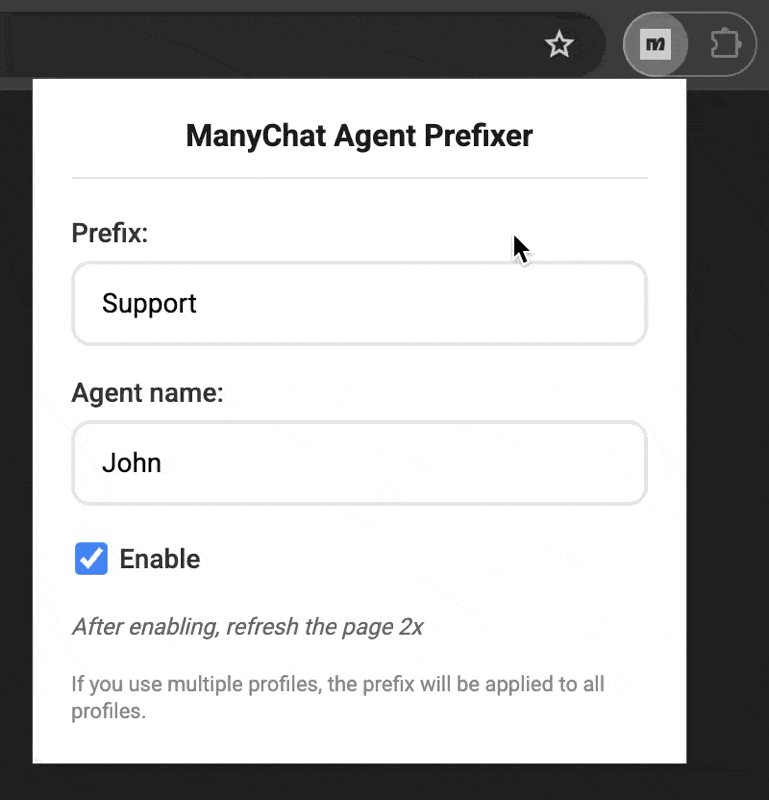
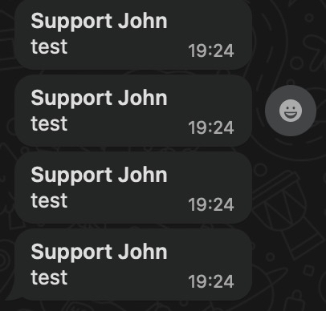

# ManyChat Agent Prefixer - Chrome Extension

A Chrome browser extension that automatically adds customizable prefixes to messages sent through ManyChat's web interface.

## 🚀 Features

- **Automatic Prefix Addition**: Adds your custom title and name to every message
- **Multiple Send Methods**: Works with Enter key, "Send WhatsApp" button, and "Send & Close" button  
- **Multi-language Support**: Compatible with English, Spanish, and Portuguese ManyChat interfaces
- **Easy Configuration**: Simple popup interface to configure settings
- **Privacy First**: All data stored locally - no data collection or transmission

## 📸 Screenshots

### Extension Popup & Configuration
Configure your title, name, and enable/disable the prefixer:



### ManyChat Interface Integration
See how the extension seamlessly integrates with ManyChat and applies prefixes:



### Message Example
**Before**: `Hello, how can I help you?`  
**After**: `*Support - John*\nHello, how can I help you?`

## 🛠️ Installation

### From Chrome Web Store
1. Visit the [Chrome Web Store listing](#) *(coming soon)*
2. Click "Add to Chrome"
3. Configure your settings by clicking the extension icon

### Manual Installation (Development)
1. Clone this repository
2. Open Chrome and go to `chrome://extensions/`
3. Enable "Developer mode" in the top right
4. Click "Load unpacked" and select the extension folder

## ⚙️ Configuration

1. Click the extension icon in your Chrome toolbar
2. Enter your **Title** (e.g., "Support Agent", "Sales Rep")
3. Enter your **Name** 
4. Check "Activate Prefixer" to enable
5. Start using ManyChat - your prefix will be automatically added!

## 🔧 How It Works

The extension monitors ManyChat's message input field and automatically prepends your configured prefix when you:
- Press Enter to send a message
- Click "Send WhatsApp" button
- Click "Send & Close" button

## ⚠️ Important Notes

- **Multiple ManyChat Accounts**: If you're connected to multiple ManyChat accounts, the extension will apply the prefix to the currently active tab/window
- **Page Refresh**: Sometimes it may be necessary to refresh the page more than once for the extension to work correctly after activation
- **Cross-Account Support**: The same prefix configuration will be applied across all your ManyChat accounts in the browser

## 🌍 Supported Languages

- 🇺🇸 English
- 🇪🇸 Spanish  
- 🇧🇷 Portuguese

## 📋 Permissions

- **Storage**: To save your preferences locally
- **All URLs**: To detect and modify ManyChat interface across different domains

## 🔒 Privacy

This extension:
- ✅ Stores all data locally on your device
- ✅ Never transmits data to external servers
- ✅ No tracking or analytics
- ✅ No registration required

See our [Privacy Policy](PRIVACY_POLICY.md) for details.

## 🛡️ Terms of Use

By using this extension, you agree to our [Terms of Use](TERMS_OF_USE.md).

## 🐛 Issues & Support

Found a bug or have a feature request? Please [open an issue](../../issues).

## 🤝 Contributing

Contributions are welcome! Please feel free to submit a Pull Request.

## 📝 Development

### Project Structure
```
├── manifest.json          # Extension manifest
├── content.js             # Main functionality
├── popup.html             # Settings interface
├── popup.js               # Settings logic
├── background.js          # Service worker
├── icon-*.png             # Icons (16x16, 48x48, 128x128)
└── docs/                  # Documentation
    ├── PRIVACY_POLICY.md
    ├── TERMS_OF_USE.md
    └── STORE_DESCRIPTIONS.md
```

### Building for Chrome Web Store
1. Update version in `manifest.json`
2. Create ZIP with extension files (exclude docs)
3. Upload to Chrome Web Store Developer Console

## 📄 License

This project is licensed under the MIT License - see the [LICENSE](LICENSE) file for details.

## ⚠️ Disclaimer

This extension is not affiliated with, endorsed by, or connected to ManyChat. ManyChat is a trademark of their respective owners.

---

**Version**: 1.0  
**Last Updated**: July 2025